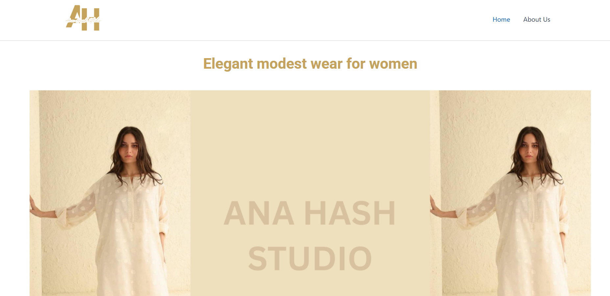
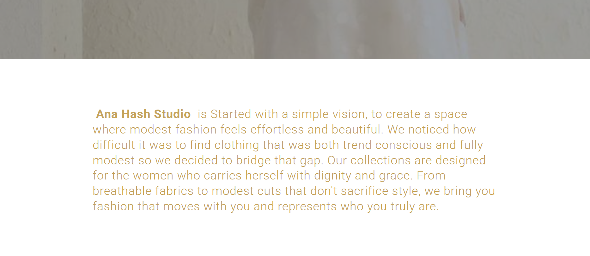
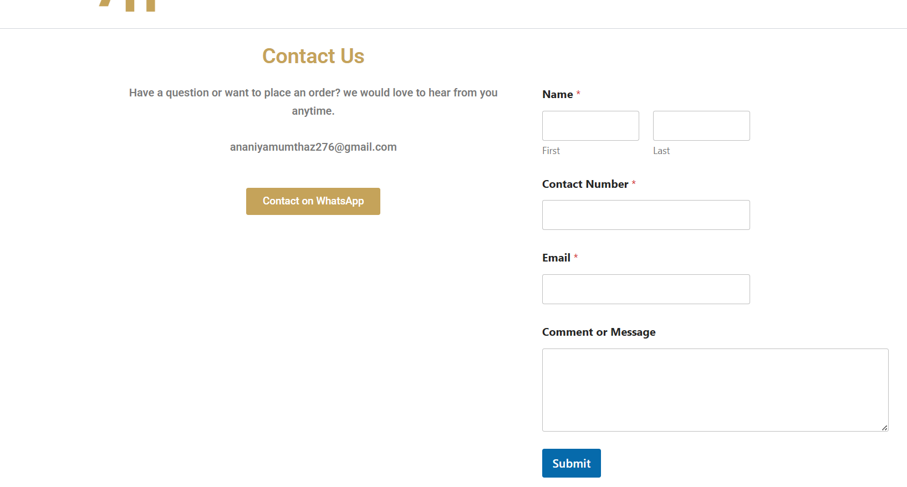

## Website Preview

### Home Page

### About page

### Our collection

### Contact Page

# WordPress Website Project

## Project Overview
This project is a business website developed using WordPress. The website was designed, customized and optimized for both user experience and search engine visibility.

## Features
- Responsive website design
- Theme customization
- Home, About, Services and Contact pages
- Mobile-friendly layout
- SEO optimized structure

## Tools Used
- WordPress
- Elementor Page Builder
- Rank Math SEO Plugin
- Theme Customization
- HTML & CSS customization

## Theme Customization Work
- Customized WordPress theme layout
- Header and footer customization
- Color, typography and layout adjustments
- Mobile responsiveness optimization

## SEO Optimization Work
- Meta title and meta description setup
- Keyword optimization using Rank Math SEO
- On-page SEO configuration
- Image ALT tag optimization
- XML sitemap setup
- Basic technical SEO implementation

## My Role
Designed, customized and optimized the complete website including theme customization, UI layout and SEO setup.

## Live Website
https://anahashmi.in/
